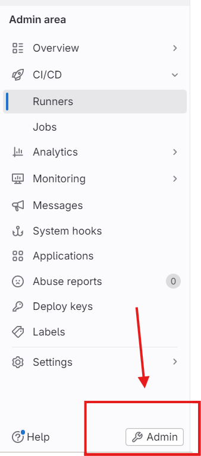
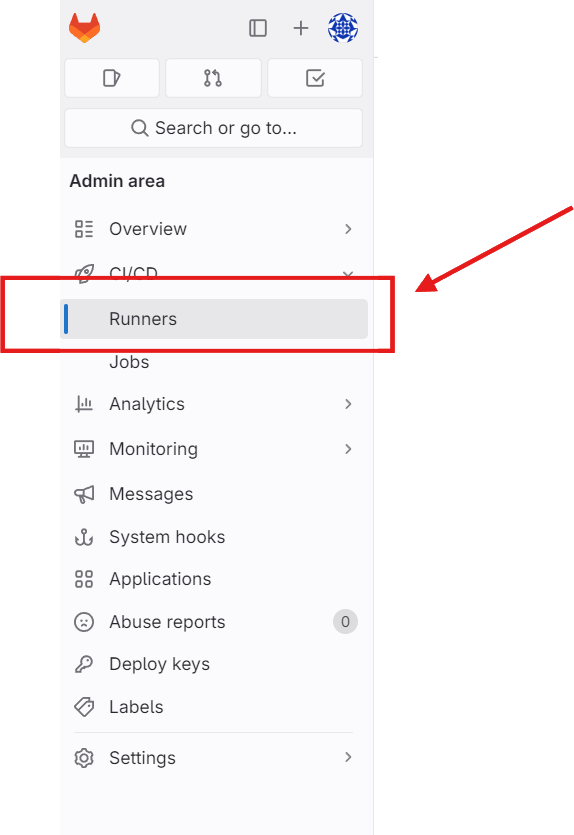
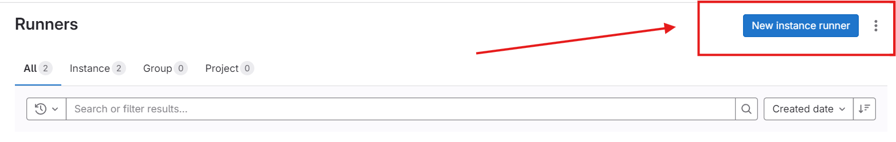
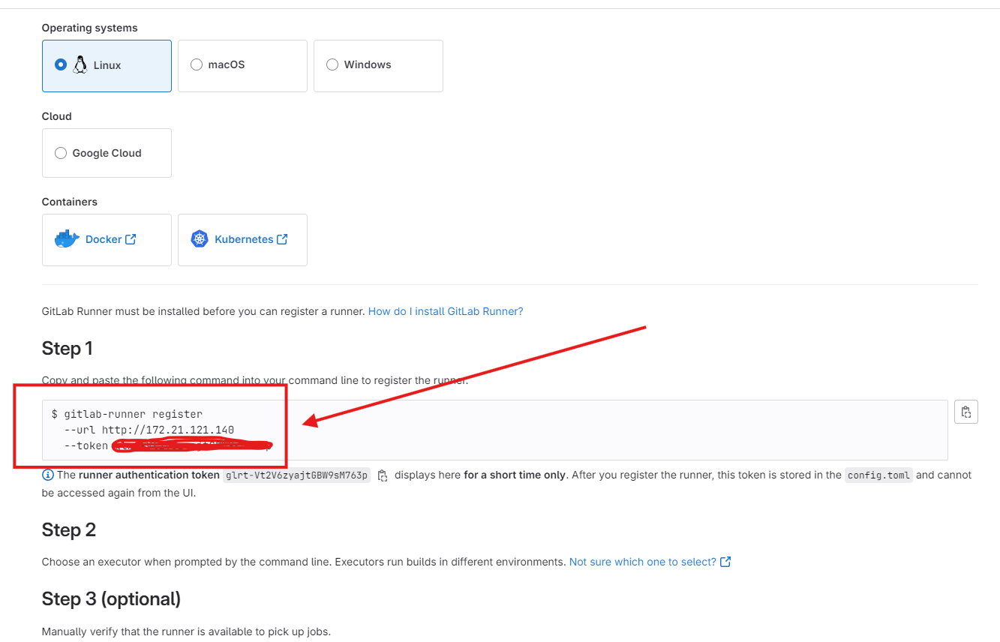
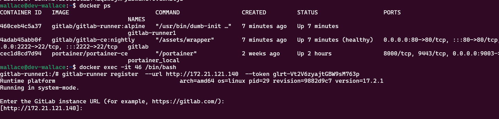
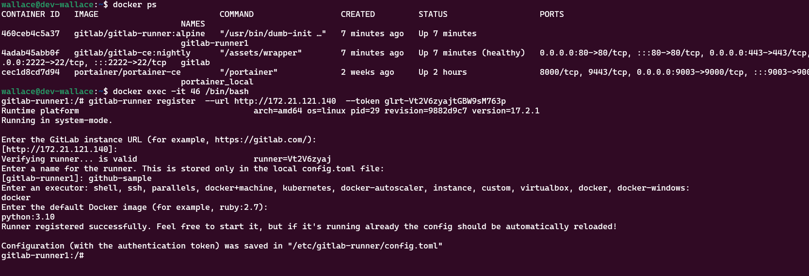
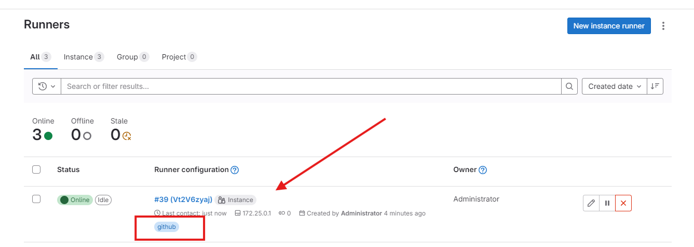

# Gitlab
Gitlab Server rodando no Docker

Video tutorial: https://youtu.be/UDcW_MpF-TI

## Como utilizar o projeto?
Clone o repositório
```
git clone https://github.com/wlcamargo/gitlab
```
Entre na pasta
```
cd gitlab
```
Execute o comando para baixar as imagens e rodar os containers
```
sudo docker compose up -d
```

## Como acessar?
localhost

## Primeiro login:
username: root

get password:
```
sudo docker exec -it gitlab grep 'Password:' /etc/gitlab/initial_root_password
```

## Adicionar Runner









Entre no container do ```gitlab-runner```

Copie o cole o token gerado na config do gitlab ui no container do ```gitlab-runner```






Sample Runner running:


## Referência
https://docs.gitlab.com/

## Developer
| Desenvolvedor      | LinkedIn                                   | Email                        | Portfólio                              |
|--------------------|--------------------------------------------|------------------------------|----------------------------------------|
| Wallace Camargo    | [LinkedIn](https://www.linkedin.com/in/wallace-camargo-35b615171/) | wallacecpdg@gmail.com        | [Portfólio](https://wlcamargo.github.io/)   |